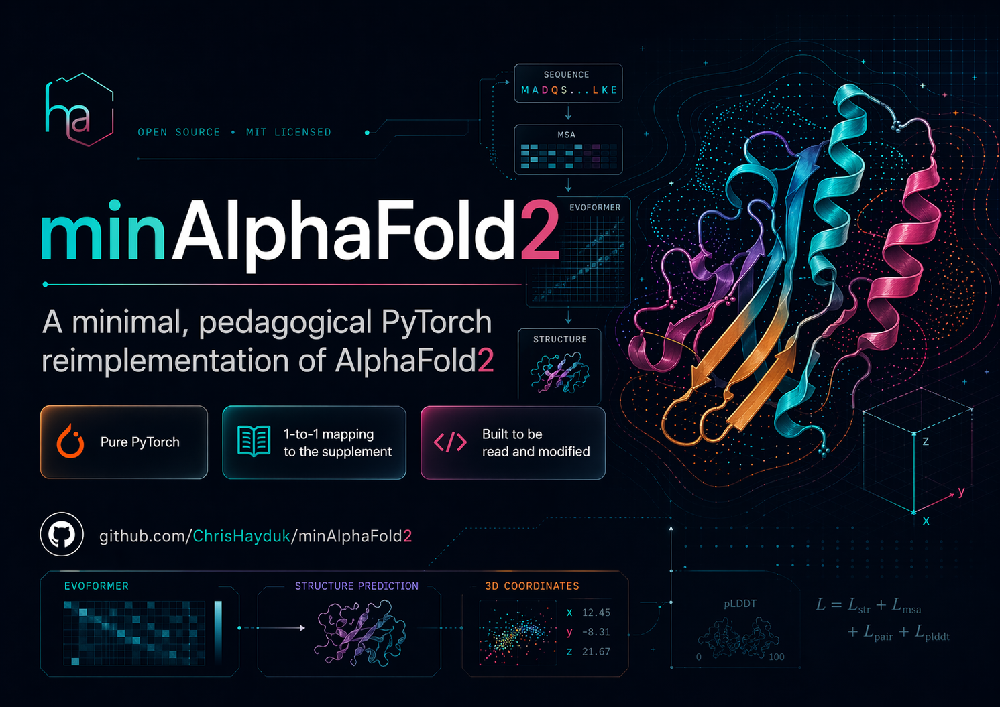

# minAlphaFold2

A minimal, pedagogical PyTorch reimplementation of [AlphaFold2](https://www.nature.com/articles/s41586-021-03819-2) — the model architecture in ~3,000 lines of pure PyTorch, ~9,000 across the whole package including losses, data pipeline, and training loop. Every module maps 1:1 to a numbered algorithm in the [62-page supplement](af2_paper.pdf).

Inspired by Andrej Karpathy's [minGPT](https://github.com/karpathy/minGPT).

<p align="center">
  
</p>

## Why this exists

AlphaFold2 is one of the most consequential deep learning systems ever shipped, but reading it usually means bouncing between a 62-page supplement, a JAX codebase tuned for Google-scale inference, and a production-grade PyTorch port (OpenFold) that adds its own scaffolding on top. The lack of clear pedagogical resources represents a bottleneck in AI x biology - it causes AI talent to allocate into more legible fields like LLMs or image generation models, thus limiting research progress, company formation, and downstream medical innovation. 

This repo aims to elimintate this bottleneck by trading production-readiness for a single property: you can sit down and read AlphaFold2 cover-to-cover in an afternoon. Every file is named after the supplement section it implements, every unusual design choice cites a paper line, and the full training recipe from Supplementary Table 4 is driven by one config.

Note that this repo is **not** an inference harness around DeepMind's weights, **not** a speed benchmark, and **not** a AF2 multimer / AF3 implementation. It is a compact, trainable single-file-per-algorithm reference you can fork, tweak, and run end-to-end on a single GPU.

## What's here

- **Pure PyTorch.** Every layer is built from `nn.Linear`, `nn.LayerNorm`, `torch.einsum`, and standard activations. No `einops`, no custom CUDA kernels, no external ML libraries.
- **1-to-1 mapping to the supplement.** Each module corresponds to a numbered algorithm or section; the [mapping](#supplement-algorithm-mapping) is the authoritative index.
- **Paper-spec training recipe.** Two-stage training (initial + fine-tune) with gradient accumulation, samples-based warmup-then-decay LR schedule, parameter EMA, gradient clipping, and a §1.9.11 violation loss that turns on at the fine-tune boundary — all driven from [`configs/training_alphafold2.toml`](configs/training_alphafold2.toml).
- **Trainable on a single GPU.** `grad_accum_steps` closes the 128-TPU-core gap; gradient checkpointing (§1.11.8) fits the 48-block Evoformer at full-chain crop sizes.
- **Cloud-GPU runners via [Modal](https://modal.com).** One command launches the full two-stage training on H200/A100; runs auto-resume from a shared checkpoint volume.

## Quickstart

```bash
git clone https://github.com/ChrisHayduk/minAlphaFold2
cd minAlphaFold2
pip install -e '.[dev]'          # core: torch, numpy; + pytest

# 5-minute sanity check: overfit a single PDB on CPU.
python scripts/overfit_single_pdb.py \
  --pdb artifacts/overfit_1a0m_A/ground_truth_1a0m_A.pdb \
  --steps 1000
```

Artifacts (predicted PDB, ground-truth PDB, PyMOL view script, per-step losses) land in `artifacts/overfit_single_pdb/<chain_id>/`. This confirms the forward pass, losses, and optimiser plumbing all work end-to-end without any of the MSA/template machinery.

## The training ladder

Three rungs, each a strict superset of the one below.

### Rung 1: single-protein overfit

Does the model work at all? Run the command above. ~1 min on CPU, ~20 s on a laptop GPU. Converges to sub-Å Cα RMSD.

### Rung 2: small-scale training on a handful of chains

Preprocess two or three OpenProteinSet chains locally (see [data pipeline](#data-pipeline) below) and run a few epochs to exercise the whole pipeline — block deletion, MSA clustering, template processing, crops, losses, checkpoints. Useful for iterating on architecture or loss changes.

```bash
python scripts/train_af2.py \
  --stage initial \
  --model-config tiny \
  --training-protocol alphafold2 \
  --checkpoint-dir checkpoints/smoke \
  --processed-features-dir data/processed_features \
  --processed-labels-dir data/processed_labels \
  --batch-size 1 --grad-accum-steps 4 \
  --epochs 2
```

### Rung 3: full AF2 reproduction (supplement Table 4)

Two stages, paper-spec hyperparameters, ~10⁷ training samples in stage 1 and ~1.5 × 10⁶ in stage 2:

```bash
# Stage 1 — random init, 10M samples, ~7 days on TPUv3.
python scripts/train_af2.py \
  --stage initial \
  --checkpoint-dir checkpoints/af2 \
  --chains-manifest data/filter_manifest.json

# Stage 2 — seed from initial, 1.5M more samples, violation loss on.
python scripts/train_af2.py \
  --stage finetune \
  --checkpoint-dir checkpoints/af2 \
  --chains-manifest data/filter_manifest.json \
  --init-from checkpoints/af2/initial_latest.pt
```

Hyperparameters (crop sizes, LR, warmup samples, violation-loss weight) come straight from [`configs/training_alphafold2.toml`](configs/training_alphafold2.toml); model architecture from [`configs/alphafold2.toml`](configs/alphafold2.toml). Both are commented line-by-line with supplement citations.

On **Modal** (single H200 / A100-80GB) the same run is one command per stage, with auto-resume across 24-hour container timeouts:

```bash
pip install -e '.[modal]'
modal setup

# One-time data upload (~100 GB).
modal volume put minalphafold-data ./data/processed_features /processed_features
modal volume put minalphafold-data ./data/processed_labels   /processed_labels

# Stage 1 — re-run as many times as it takes; auto-resumes from the latest
# checkpoint in the ``minalphafold-checkpoints`` Volume.
modal run scripts/modal_train_af2.py --stage initial

# Stage 2.
modal run scripts/modal_train_af2.py --stage finetune \
  --init-from-path /root/checkpoints/initial_latest.pt
```

Pull the final checkpoints back with `modal volume get minalphafold-checkpoints ./checkpoints`.

## Data pipeline

Training consumes [OpenProteinSet](https://registry.opendata.aws/openfold/) — the community reproduction of AlphaFold2's unreleased training set (MSAs + templates for ~140k PDB chains, same JackHMMER / HHBlits / HHSearch pipeline as the supplement §1.2.2–1.2.3). Credit to the OpenFold team for making this corpus public; we consume it directly rather than re-running external MSA tools.

Three steps, each its own script:

```bash
# 1. Download the minimal subset (MSAs + template HHR + mmCIF structures).
python scripts/download_openproteinset.py --data-root data/openproteinset

# 2. Normalise to per-chain NPZs: atom14 positions + mask + resolution,
#    clustered MSAs, projected template atoms. One pair of NPZs per chain.
python scripts/preprocess_openproteinset.py \
  --raw-root data/openproteinset \
  --processed-features-dir data/processed_features \
  --processed-labels-dir data/processed_labels

# 3. Apply supplement §1.2.5 deterministic filters — resolution < 9 Å,
#    no single amino acid > 80 % of the sequence, minimum length.
python scripts/filter_openproteinset.py \
  --processed-features-dir data/processed_features \
  --processed-labels-dir data/processed_labels \
  --manifest-out data/filter_manifest.json
```

Pass the manifest as `--chains-manifest` to `train_af2.py` to restrict training to the filtered set.

The probabilistic §1.2.5 filters (length rebalancing, inverse-cluster-size sampling) are sampler-level, not pre-filters — if you generate an MMseqs2 easy-cluster TSV at 40 % identity yourself, `filter_openproteinset.py --mmseqs-cluster-tsv` will embed per-chain cluster IDs + sizes in the manifest so a downstream sampler can apply them.

## Relax a predicted structure (supplement §1.8.6)

Raw predictions have the right fold but ideal-backbone bond lengths — FAPE is frame-invariant and never directly pins `|C_i → N_{i+1}| ≈ 1.33 Å`. §1.8.6 fixes this with **iterative restrained Amber minimisation**, and [`scripts/relax_pdb.py`](scripts/relax_pdb.py) is a faithful port:

```bash
pip install -e '.[relax]'     # OpenMM + pdbfixer
python scripts/relax_pdb.py artifacts_modal/6m0j_E/predicted_6m0j_E.pdb
# writes predicted_6m0j_E_relaxed.pdb next to the input
```

Each round minimises AMBER99SB + GBSA (OBC) implicit solvent with harmonic restraints (`k = 10 kcal/mol/Ų`) on every heavy atom, detects violations via the exact §1.9.11 eqs 44–47 criteria (reusing `losses.StructuralViolationLoss` so the rules are bit-identical), and frees only the violating residues for the next round — matching the paper's "targets with unresolved violations were re-run" escape hatch.

Caveat from the paper itself: this procedure assumes *mildly*-violating inputs. Pre-fine-tuning overfit checkpoints can violate at 30–40 % of residues — too many for this loop to resolve cleanly. If you want clean chemistry out of the box, train with the violation loss active (Rung 3, stage 2).

## Supplement algorithm mapping

| Algorithm | Description | Location |
|-----------|-------------|----------|
| 1 | MSA Block Deletion | `data.py: block_delete_msa` |
| 2 | Inference | `model.py: AlphaFold2.forward` |
| 3 | Input Embedder | `embedders.py: InputEmbedder` |
| 4 | Relative Position Encoding | `embedders.py: RelPos` |
| 5 | One-hot Nearest Bin | `utils.py: one_hot_nearest` |
| 6 | Evoformer Stack | `evoformer.py: Evoformer` |
| 7 | MSA Row Attention with Pair Bias | `evoformer.py: MSARowAttentionWithPairBias` |
| 8 | MSA Column Attention | `embedders.py: MSAColumnAttention` |
| 9 | MSA Transition | `embedders.py: MSATransition` |
| 10 | Outer Product Mean | `embedders.py: OuterProductMean` |
| 11 | Triangle Multiplication (Outgoing) | `embedders.py: TriangleMultiplicationOutgoing` |
| 12 | Triangle Multiplication (Incoming) | `embedders.py: TriangleMultiplicationIncoming` |
| 13 | Triangle Attention (Starting Node) | `embedders.py: TriangleAttentionStartingNode` |
| 14 | Triangle Attention (Ending Node) | `embedders.py: TriangleAttentionEndingNode` |
| 15 | Pair Transition | `embedders.py: PairTransition` |
| 16 | Template Pair Stack | `embedders.py: TemplatePair` |
| 17 | Template Pointwise Attention | `embedders.py: TemplatePointwiseAttention` |
| 18 | Extra MSA Stack | `embedders.py: ExtraMsaStack` |
| 19 | MSA Column Global Attention | `embedders.py: MSAColumnGlobalAttention` |
| 20 | Structure Module | `structure_module.py: StructureModule` |
| 21 | Rigid Frames from Three Points | `geometry.py: backbone_frames` |
| 22 | Invariant Point Attention (IPA) | `structure_module.py: InvariantPointAttention` |
| 23 | Backbone Update | `structure_module.py: BackboneUpdate` |
| 24 | Compute All Atom Coordinates | `structure_module.py: compute_all_atom_coordinates` |
| 25 | Rigid-group Frames from Torsions | `structure_module.py: make_rot_x`, `compose_transforms`, `rigid_group_frames_from_torsions` |
| 26 | Rename Symmetric Ground Truth Atoms | `losses.py: select_best_atom14_ground_truth`; ground-truth side: `data.py: build_supervision` |
| 27 | Torsion Angle Loss | `losses.py: TorsionAngleLoss` |
| 28 | FAPE (Backbone) | `losses.py: BackboneFAPE` |
| 28 | FAPE (All-Atom) | `losses.py: AllAtomFAPE` |
| 29 | PLDDT Head | `heads.py: PLDDTHead` & `losses.py: PLDDTLoss` |
| 30 | Inference with Recycling | `model.py: AlphaFold2.forward` (fixed number of cycles during inference) |
| 31 | Training with Recycling | `model.py: AlphaFold2.forward` (random cycle sampling) |
| 32 | Recycling Embedder | `model.py: AlphaFold2.forward` (recycle norms + distance bins) |

Losses beyond the algorithm table: `losses.StructuralViolationLoss` implements §1.9.11 eqs 44–47, `losses.DistogramLoss` §1.9.8 eq 41, `losses.MSALoss` §1.9.9 eq 42, `losses.ExperimentallyResolvedLoss` §1.9.10 eq 43, `losses.TMScoreLoss` §1.9.7 eqs 38–40.

## Repo layout

```
minalphafold/
    a3m.py                # A3M parsing and MSA tokenization
    mmcif.py              # mmCIF atom-site parsing → atom14 coordinates
    pdbio.py              # PDB writer for predicted structures (pLDDT → B-factor)
    geometry.py           # Rigid frames, torsions, pseudo-β helpers for supervision
    residue_constants.py  # Amino acid chemical data
    data.py               # Processed-cache dataset, crops, collation, feature builders
    initialization.py     # Linear init helpers
    utils.py              # Row/column dropout, distance binning, recycling distogram
    embedders.py          # Input embedding, RelPos, every attention/update submodule (Alg 8–19)
    evoformer.py          # Evoformer block (Alg 6); MSA row attention with pair bias (Alg 7)
    structure_module.py   # Structure Module, IPA, backbone update, all-atom coordinates
    heads.py              # Distogram, pLDDT, masked MSA, PAE/TM-score, experimentally-resolved
    losses.py             # FAPE (backbone + all-atom), torsion, pLDDT, distogram, MSA, violations
    model.py              # Top-level AlphaFold2, recycling loop, ensemble averaging
    model_config.py       # Typed ModelConfig dataclass — schema for configs/*.toml
    trainer.py            # fit(), TrainingProtocol / TrainingConfig / DataConfig, EMA, grad accum, resume
configs/
    tiny.toml                    # Shrunk-to-CPU model profile (default for tests / smoke runs)
    medium.toml                  # Mid-sized model profile for local overfit experiments
    alphafold2.toml              # Paper-spec monomer model config (supplement 1.5–1.8 exact)
    training_alphafold2.toml     # Paper-spec two-stage training protocol (supplement Table 4 + §1.11)
scripts/
    download_openproteinset.py   # OpenProteinSet downloader
    preprocess_openproteinset.py # Raw OpenProteinSet → per-chain NPZ caches
    filter_openproteinset.py     # §1.2.5 filter manifest (resolution, single-AA, min length)
    train_af2.py                 # Paper-spec two-stage training driver (local)
    modal_train_af2.py           # Modal Labs wrapper for train_af2
    overfit_single_pdb.py        # Single-PDB overfit (no MSAs/templates) — sanity check
    overfit_processed_chain.py   # Full-pipeline overfit on one preprocessed chain
    modal_overfit.py             # Modal wrapper for overfit_processed_chain
    modal_overfit_single_pdb.py  # Modal wrapper for overfit_single_pdb
    relax_pdb.py                 # Amber-style structure relaxation (supplement 1.8.6)
tests/                           # 163 tests
af2_paper.pdf                    # AF2 supplement — PRIMARY REFERENCE
```

## Key design decisions

- **Pure PyTorch primitives.** `nn.Linear`, `nn.LayerNorm`, `torch.einsum`, `torch.sigmoid`, `F.softmax`, `F.relu`. Nothing else.
- **Config-as-object.** Channel dims (`c_m` MSA, `c_s` single, `c_z` pair, `c_e` extra MSA, `c_t` template pair) thread through every module via one config. Projection `c_m → c_s` happens via `single_rep_proj` in `model.py`.
- **Explicit masking throughout.** Every attention and update module accepts optional `seq_mask`, `msa_mask`, or `pair_mask` tensors, and masks propagate from top-level input all the way into loss computation.
- **nm/Å boundary at the Structure Module edge.** The Structure Module operates internally in nanometres (matching the supplement). The boundary is at `StructureModule.__init__` (Å → nm) and `StructureModule.forward` (nm → Å). No unit mixing inside.
- **Zero-init per §1.11.4.** Output projections for attention modules, transition blocks, and head logits are zero-initialised. Gate biases init to 1 so `sigmoid(1) ≈ 0.73` starts mostly-open. `AlphaFold2._initialize_alphafold_parameters` enforces the sweep.
- **Relative imports inside the package.** Every `minalphafold/*.py` uses `from .X import Y` — no dual-path shims. `tests/conftest.py` and each script's preamble put the repo root on `sys.path`.

## Scope and caveats

**Faithful to the paper:**

- All 32 supplement algorithms (see the mapping above).
- Training recipe: two stages, samples-based LR schedule (linear warm-up → constant → one-shot ×0.95 drop), Adam(0.9, 0.999, ε=1e-6), per-example gradient clipping at global-norm 0.1, parameter EMA with decay 0.999 for validation/checkpoint selection, violation-loss on in stage 2 only.
- Deterministic §1.2.5 data filters (resolution < 9 Å, single-AA dominance ≤ 80 %).

**Deliberate pedagogical choices:**

- Gradient accumulation substitutes for the paper's 128-TPU-core data parallelism. Per-example clipping is exact at `batch_size = 1`; at larger micro-batches it becomes per-micro-batch (slight deviation, documented inline).
- The trainer runs on one device only — no distributed data parallel, no sharded optimisers, no mixed-precision scaffolding beyond PyTorch's native autocast.

**Out of scope — use another project if you need:**

- **Self-distillation dataset** (§1.3). Requires running a trained AF2 over Uniclust30 to generate pseudo-labels; OpenFold's pipeline does this properly.
- **Custom MSA generation.** We consume [OpenProteinSet's](https://registry.opendata.aws/openfold/) pre-computed MSAs directly; running JackHMMER / HHBlits / HHSearch yourself is out of scope.
- **40 %-identity MMseqs2 clustering for the inverse-cluster-size sampler.** The filter script accepts a pre-computed cluster TSV and embeds sizes in the manifest; generating the clustering is a one-liner (`mmseqs easy-cluster ...`) outside this repo.
- **Multimer support.** Monomer only. AF3 / AF-Multimer architectures are different projects.

## Tests

```bash
pytest -q
```

163 tests cover: parsers (`test_a3m`, `test_mmcif`, `test_pdbio`), geometry, dataset + preprocessing + filter manifest, loss heads, shape/semantic coverage of every model module, training-loop behaviour (grad accumulation, paper LR schedule, EMA, resume, stage derivation), and the OpenProteinSet download + preprocessing scripts.

## License

MIT. See [LICENSE](LICENSE).

`residue_constants.py` contains data derived from the [AlphaFold2 source code](https://github.com/google-deepmind/alphafold), which is licensed under Apache 2.0.

## Acknowledgments

- Jumper, J. et al. "Highly accurate protein structure prediction with AlphaFold." *Nature* 596, 583–589 (2021). The [supplementary information](https://static-content.springer.com/esm/art%3A10.1038%2Fs41586-021-03819-2/MediaObjects/41586_2021_3819_MOESM1_ESM.pdf) is the primary reference for this implementation.
- The OpenFold team for [OpenProteinSet](https://registry.opendata.aws/openfold/) and their [Nature Methods paper](https://www.nature.com/articles/s41592-024-02272-z) — the open reproduction of AF2's training corpus that makes full-scale training tractable outside Google.
- Andrej Karpathy's [minGPT](https://github.com/karpathy/minGPT) for the inspiration of minimal, readable reimplementations.
